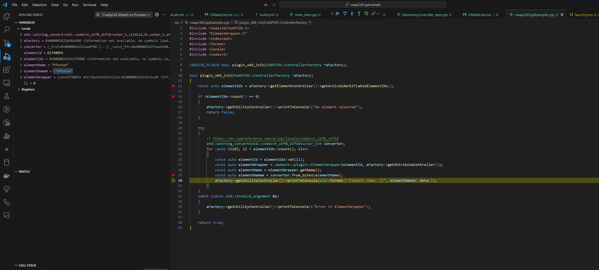

# cwapi3dCppExample

This project demonstrates how to use the CwAPI3D library. The example plugin initializes a connection with the CAD application, retrieves active elements, and prints their names to the console.

## Prerequisites

- CMake
- A C++ compiler
- CwAPI3D library

## Building the Project

1. Clone the repository:
    ```sh
    git clone https://github.com/cwapi3d/cwapi3dCppExample.git
    cd cwapi3dCppExample
    ```

2. Create a build directory and configure the project using CMake:
    ```sh
    cmake -S . -B build
    ```

3. Build the project:
    ```sh
    cmake --build build
    ```

## Running the Plugin

1. Ensure that the CAD application is running and the CwAPI3D library is properly configured.
2. Load the compiled plugin into the CAD application.
3. The plugin will print the names of active elements to the console.

## Code Overview

### `cwapi3dCppExample.cpp`

This file contains the main logic for the plugin. The `plugin_x64_init` function initializes the plugin, retrieves active elements, and prints their names to the console.

#### Key Functions:

- `plugin_x64_init(CwAPI3D::ControllerFactory *aFactory)`: Initializes the plugin and interacts with the CAD application.

### Debugging

Attach a debugger to the CAD application to debug the plugin. 

For example, use Visual Studio to attach to the CAD application process. See the [launch.json](.vscode/launch.json) file for the configuration.


